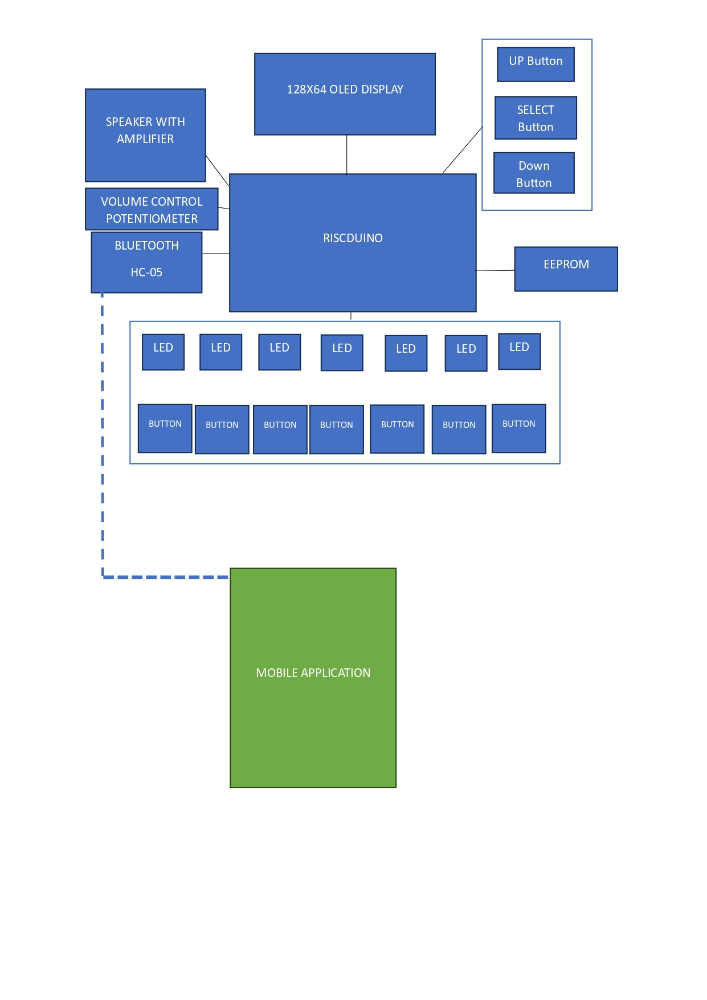
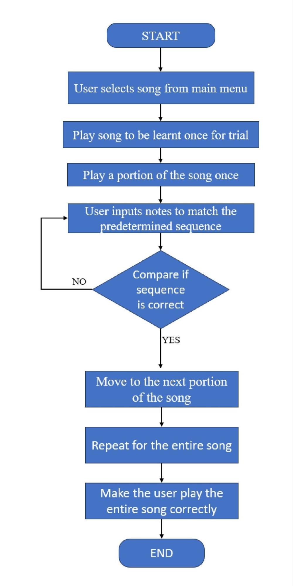
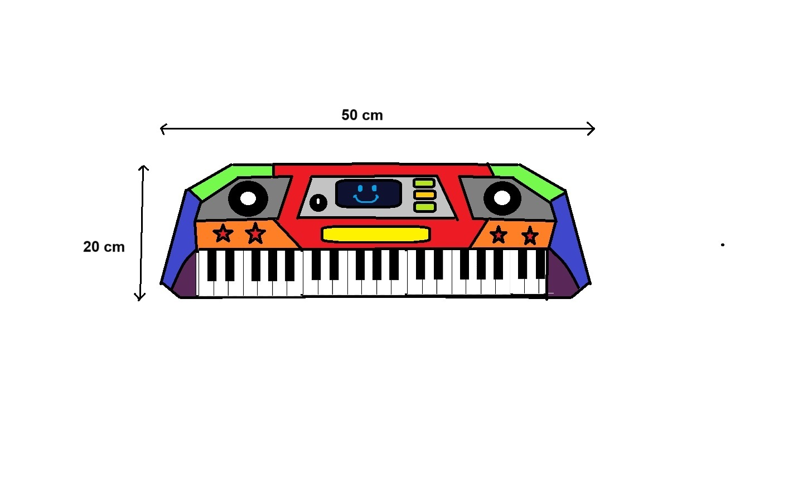
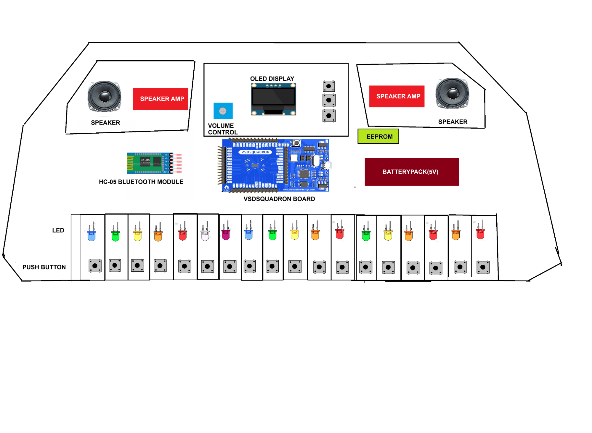

<!-- You have some errors, warnings, or alerts. If you are using reckless mode, turn it off to see inline alerts.
* ERRORs: 0
* WARNINGs: 0
* ALERTS: 4 -->

RISC-V Product Development Hackathon:

Team Name: Melodica          			Team Members:  Sujay Samuel S

                                  Samuel Robinson R

**Stage 1-Product Idea Submission Form**

1. **Product Title**

**	“Melody Master Jr”- Unlock the world of Music!!**

2. **What does your product do?  \
      **- Plays Music

          - Teaches kids to play the piano

	      - Provides Interactive OLED interface for song selection

          - Features illuminated keys

          - Upload new songs using mobile application Via Bluetooth

3. **What all interfaces of the board will be used in the product ?**

    We will be using GPIO PINS for the Speaker Output, Key input and LED Output, UART protocol for the Bluetooth connection and I2C for the OLED display and EEPROM.

4. **Does the product utilise sensors?**
* No
5. **Block Diagram**

6. **Algorithm flowchart**

    

7. **Algorithm of the product in bullet points.**

_        _

1. User selects song from main menu:

    The user begins by choosing a song they'd like to learn from an array of songs that are stored in the memory. Also new songs can be loaded onto the toy by an app via bluetooth.

2. Play song to be learnt once for trial:

    The song is played once to provide the user with an initial listening experience. It also gives the user a feel for how the song should sound.     

3. Play a portion of the song once:

    Next, a section of the song is played to familiarize the user with a part of the melody. This is for the user to get a better understanding of the portion of the song.

4. User inputs notes to match the predetermined sequence:

    This is the learning phase. The user attempts to play the notes they heard, trying to match the provided sequence. 

5. Compare if sequence is correct: 

    The system stores the user’s key-strokes and then checks if the user's input matches the expected sequence of notes. The user is evaluated based on whether the timing is correct and if the notes played by the user match that determined by the song. 

6. If not request user to repeat again: 

    If there's an error, the user is encouraged to try again, until they get the sequence right twice. This is to ensure that the user 

7. Move to next portion of the piece once the user gets sequence correct twice:

    Once the user successfully reproduces the sequence twice, they progress to the next part of the song. This is mainly to make sure the user gets a good grip of the song.

8. Keep repeating till the entire song is complete:

    The learning process continues, segment by segment, until the entire song is learned.

9. Make the user play the song once through and encourage the user to play correctly:

    The user is then made to play the entire song as a whole after consolidating all the learnings of the individual parts of the songs

10.  User can upload new songs via bluetooth, and delete to conserve memory.
8. **Rough sketch of the final product.**

    

9. **Rough sketch of the Internal product **

    

10. **BoM list (excluding the board) with cost.**

<table>
  <tr>
   <td>
<strong>Component name</strong>
   </td>
   <td><strong>Quantity Required</strong>
   </td>
   <td><strong>Unit price</strong>
   </td>
   <td><strong>Total Price</strong>

<strong>(Unit price*Quantity)</strong>
   </td>
  </tr>
  <tr>
   <td><strong>OLED Display</strong>
   </td>
   <td><strong>1</strong>
   </td>
   <td><strong>Rs 163/-</strong>
   </td>
   <td><strong>Rs 163/-</strong>
   </td>
  </tr>
  <tr>
   <td><strong>HC-05 Bluetooth module</strong>
   </td>
   <td><strong>1</strong>
   </td>
   <td><strong>Rs 200/-</strong>
   </td>
   <td><strong>Rs 200/-</strong>
   </td>
  </tr>
  <tr>
   <td><strong>8 Ohm Speaker</strong>
   </td>
   <td><strong>2</strong>
   </td>
   <td><strong>Rs 45/-</strong>
   </td>
   <td><strong>Rs 90/-</strong>
   </td>
  </tr>
  <tr>
   <td><strong>LM386 Speaker amplifier</strong>
   </td>
   <td><strong>2</strong>
   </td>
   <td><strong>Rs 45/-</strong>
   </td>
   <td><strong>Rs 90/-</strong>
   </td>
  </tr>
  <tr>
   <td><strong>EEPROM</strong>
   </td>
   <td><strong>1</strong>
   </td>
   <td><strong>Rs 65/-</strong>
   </td>
   <td><strong>Rs 65/-</strong>
   </td>
  </tr>
  <tr>
   <td><strong>Trimpot Trimmer Potentiometer</strong>
   </td>
   <td><strong>1</strong>
   </td>
   <td><strong>Rs 12/-</strong>
   </td>
   <td><strong>Rs 12/-</strong>
   </td>
  </tr>
  <tr>
   <td><strong>Push Button Switch </strong>
   </td>
   <td><strong>20</strong>
   </td>
   <td><strong>Rs 1.7/-</strong>
   </td>
   <td><strong>Rs 34/-</strong>
   </td>
  </tr>
  <tr>
   <td><strong>LEDs</strong>
   </td>
   <td><strong>18</strong>
   </td>
   <td><strong>Rs 1/-</strong>
   </td>
   <td><strong>Rs 18/-</strong>
   </td>
  </tr>
  <tr>
   <td><strong>Battery Holder</strong>
   </td>
   <td><strong>1</strong>
   </td>
   <td><strong>Rs 30/-</strong>
   </td>
   <td><strong>Rs 30/-</strong>
   </td>
  </tr>
  <tr>
   <td><strong>Resistors</strong>
   </td>
   <td><strong>30</strong>
   </td>
   <td><strong>Rs 0.5/-</strong>
   </td>
   <td><strong>Rs 15/-</strong>
   </td>
  </tr>
  <tr>
   <td><strong>TOTAL </strong>
   </td>
   <td>
   </td>
   <td>
   </td>
   <td><strong>Rs 717/-</strong>
   </td>
  </tr>
</table>

11. **Team details**

<table>
  <tr>
   <td>
<strong>Name</strong>
   </td>
   <td><strong>University/Organisation</strong>
   </td>
   <td><strong>Age</strong>
   </td>
   <td><strong>Gender</strong>
   </td>
   <td><strong>Current Semester</strong>
   </td>
   <td><strong>Current Address</strong>
   </td>
   <td><strong>Do you need accommodation if the Demo is to done in Bangalore</strong>
   </td>
   <td><strong>Role in Product Development</strong>
   </td>
  </tr>
  <tr>
   <td>Sujay Samuel Shantakumar
   </td>
   <td>SSN College Of Engineering
   </td>
   <td>21
   </td>
   <td>Male
   </td>
   <td>7
   </td>
   <td>1-D Abirami Meadowland, 32 Park Road, Anna Nagar, Chennai-50
   </td>
   <td>yes
   </td>
   <td>Embedded Software developer, 

Product design.
   </td>
  </tr>
  <tr>
   <td>Samuel Robinson R
   </td>
   <td>SSN College Of Engineering
   </td>
   <td>20
   </td>
   <td>Male
   </td>
   <td>7
   </td>
   <td>2B, 

Adyar Foliage, 18, Second Main Road, Gandhinagar, Adyar, Chennai-600020
   </td>
   <td>yes
   </td>
   <td>Embedded Software Developer
   </td>
  </tr>
</table>

